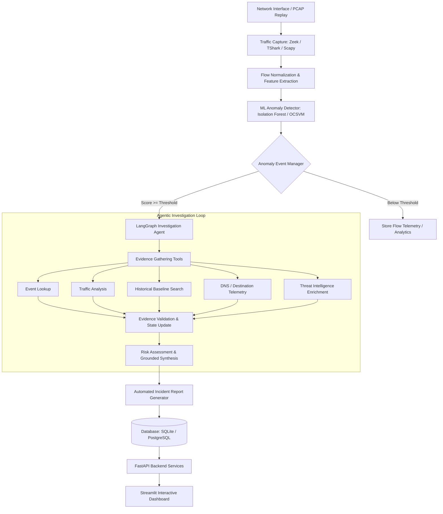
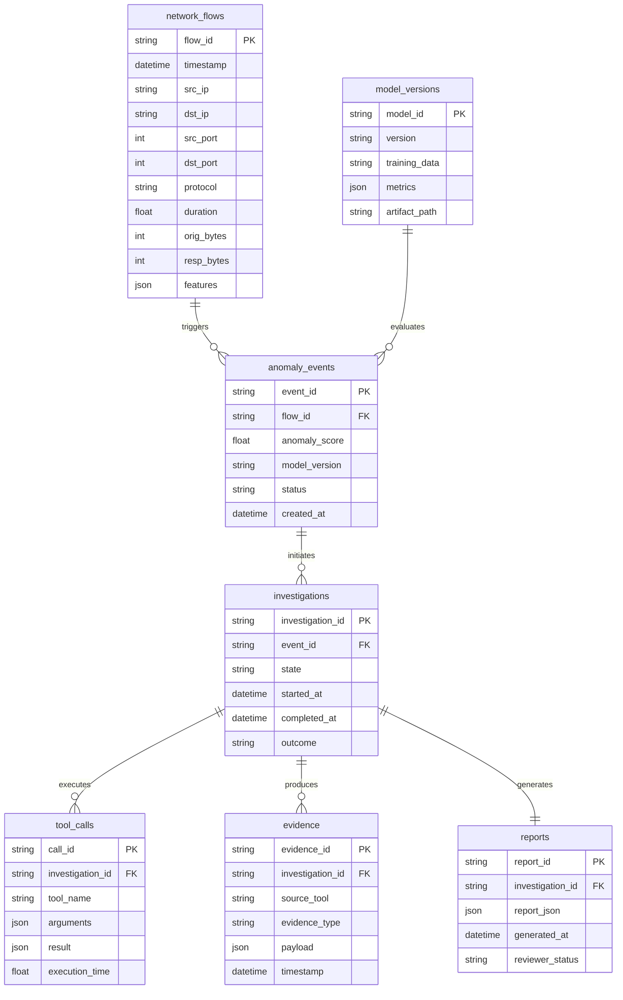

# NetSentry AI 🛡️🤖

> **Intelligent Network Anomaly Detection and Evidence-Grounded Agentic Investigation System**

[](https://www.python.org/)
[](https://fastapi.tiangolo.com/)
[](https://langchain-ai.github.io/langgraph/)
[](https://streamlit.io/)
[](https://scikit-learn.org/)
[](https://www.docker.com/)
[](LICENSE)

---

## 📌 Executive Summary

**NetSentry AI** is an end-to-end intelligent network monitoring and security investigation platform. The system continuously observes network traffic, transforms raw packets into structured flow records, extracts statistical and behavioral features, identifies abnormal traffic patterns using machine learning, and initiates an **evidence-driven agentic investigation** whenever an anomaly crosses a configurable threshold.

### ⚖️ Core Philosophy: Separation of Responsibilities

Traditional security tools often suffer from alert fatigue without clear context, while naive LLM implementations hallucinate non-existent threats. NetSentry AI solves this with strict separation of concerns:

- **ML Layer (Detection)**: Statistical models (e.g., Isolation Forest, One-Class SVM, Autoencoders) are responsible for high-throughput anomaly detection and continuous scoring.
- **Agentic LLM Layer (Investigation)**: A LangGraph-orchestrated LLM is strictly used for investigation, hypothesis testing, and explanation. It is **never** trusted to invent evidence; instead, it queries deterministic read-only tools to inspect telemetry, verify baselines, and correlate context before compiling structured incident reports.

---

## 🏗️ High-Level System Architecture



### End-to-End Pipeline Overview

1. **Traffic Capture & Ingestion**: Monitors live interfaces or replays PCAP files using Zeek, TShark, or Scapy/PyShark.
2. **Flow Parsing & Normalization**: Converts raw packets into structured flow records (IPs, ports, protocols, byte/packet counts, durations).
3. **Feature Engineering**: Computes connection rates, duration statistics, burst metrics, and rolling behavioral aggregations.
4. **Machine Learning Anomaly Detection**: Generates continuous anomaly scores using an Isolation Forest baseline (with One-Class SVM / Autoencoder extensions).
5. **Event Management & Triage**: Applies thresholding, deduplication, and aggregation to prevent alert floods and optimize LLM invocations.
6. **LangGraph Agentic Investigation**: A stateful workflow queries deterministic tools to collect verifiable evidence and evaluate hypotheses.
7. **Hallucination Control & Grounding**: LLM findings must cite specific tool outputs; basic metrics and risk scores remain deterministic.
8. **Incident Reporting & Visualization**: Generates structured JSON/Markdown incident reports and presents interactive dashboards for SOC analyst review.

---

## 📁 Repository Structure

```text
NetSentry AI/
├── capture/                  # Traffic capture and packet ingestion
│   ├── zeek_ingest.py        # Zeek log streamer / reader
│   ├── pcap_reader.py        # Offline PCAP replay & ingestion engine
│   └── normalizer.py         # Schema normalization for raw telemetry
├── features/                 # Feature extraction & processing
│   ├── flow_features.py      # Flow-level feature extractors
│   ├── aggregations.py       # Rolling-window & behavioral aggregations
│   └── preprocessing.py      # Scalers, encoders, and transformation pipelines
├── ml/                       # Machine learning anomaly detection
│   ├── train.py              # Model training scripts
│   ├── predict.py            # Scoring & inference pipeline
│   ├── evaluate.py           # Model validation (ROC-AUC, Precision, Recall)
│   └── models/               # Serialized model artifacts (.joblib, .pt)
├── events/                   # Event lifecycle management
│   ├── event_manager.py      # Triage, deduplication, queue management
│   └── threshold.py          # Dynamic & static score threshold policies
├── agent/                    # Agentic AI investigation framework
│   ├── graph.py              # LangGraph state machine definition
│   ├── state.py              # InvestigationState schema
│   ├── prompts.py            # Evidence-grounded system prompts
│   └── tools/                # Deterministic investigation tools
│       ├── traffic.py        # Connection & flow statistics tool
│       ├── history.py        # Source/destination historical activity
│       ├── dns.py            # DNS query and domain correlation
│       └── threat_intel.py   # External reputation lookup (optional)
├── api/                      # Backend REST API
│   ├── main.py               # FastAPI application entrypoint
│   └── routes/               # API route controllers
│       ├── flows.py          # Query normalized flow records
│       ├── anomalies.py      # Anomaly event retrieval
│       ├── investigations.py # Agent investigation triggers & status
│       └── reports.py        # Incident report download & review
├── database/                 # Persistence layer
│   ├── models.py             # SQLAlchemy ORM schemas
│   └── repository.py         # Database CRUD operations
├── dashboard/                # User interface
│   └── app.py                # Streamlit multi-page monitoring dashboard
├── reports/                  # Automated reporting engine
│   ├── generator.py          # Structured report builder (Markdown/PDF/JSON)
│   └── templates/            # Report rendering templates
├── evaluation/               # Benchmark and evaluation suite
│   ├── ml_metrics.py         # Precision, Recall, F1, Confusion Matrix
│   ├── agent_eval.py         # Grounding, tool accuracy, hallucination audits
│   └── benchmark.py          # End-to-end latency & performance tests
├── tests/                    # Unit and integration tests
├── configs/                  # YAML / JSON system configurations
├── docker/                   # Dockerfiles and docker-compose configurations
├── requirements.txt          # Python dependencies
└── README.md                 # Project documentation
```

---

## 🛠️ Tech Stack & Key Technologies

| Layer | Recommended Choice | Alternatives |
| :--- | :--- | :--- |
| **Language** | Python 3.10+ | — |
| **Traffic Telemetry** | Zeek, Scapy, TShark / PyShark | CICFlowMeter, Argus |
| **Data Processing** | Pandas, NumPy | Polars |
| **ML Engine** | scikit-learn (Isolation Forest) | PyTorch (Autoencoder), XGBoost |
| **Agent Orchestration** | LangGraph, LangChain Core | Custom State Machine |
| **LLM Provider** | Tool-calling capable LLMs (Gemini / OpenAI / Claude / Ollama) | Local vLLM / HuggingFace |
| **Backend API** | FastAPI + Uvicorn | Flask |
| **Database** | PostgreSQL (Production) / SQLite (MVP) | DuckDB |
| **Dashboard** | Streamlit | React / Next.js |
| **Packaging** | Docker, Docker Compose | Virtualenv |

---

## 🧠 Machine Learning & Telemetry Specifications

### Example Normalized Flow Record

```json
{
  "timestamp": "2026-09-16T13:42:21Z",
  "src_ip": "192.168.1.10",
  "dst_ip": "10.0.0.25",
  "src_port": 51432,
  "dst_port": 443,
  "protocol": "TCP",
  "duration": 2.31,
  "orig_bytes": 12421,
  "resp_bytes": 85921,
  "orig_pkts": 32,
  "resp_pkts": 91
}
```

### Flow-Level & Behavioral Features

- **Connection Metrics**: Duration, connection state, TCP flags, header lengths.
- **Volume & Packets**: `orig_bytes`, `resp_bytes`, `total_bytes`, `orig_pkts`, `resp_pkts`.
- **Rate & Temporal Dynamics**: Bytes/sec, packets/sec, burst duration, time of day.
- **Behavioral Aggregations**: Unique destination IPs in rolling window, unique destination ports, failed connection ratio, deviation from 24h baseline.

### Supported Datasets

- **CIC-IDS2017 & CSE-CIC-IDS2018**: Standard network intrusion benchmarks for benign & attack scenarios (DDoS, Port Scans, Botnets, Infiltration).
- **UNSW-NB15**: Modern realistic low-footprint attack traffic patterns.
- **Authorized PCAP / Lab Replay**: Controlled synthetic anomalies (e.g. rapid scanning, abnormal port diversity, burst volumes).

---

## 🕵️ Agentic AI Investigation Workflow (LangGraph)

When an event exceeds the configured anomaly score threshold (e.g., score $\ge 0.85$), an investigation instance is triggered.

### Core Investigation State

```python
class InvestigationState(TypedDict):
    event: dict                   # Original anomaly trigger metadata
    evidence: list[dict]          # Collected verifiable telemetry data
    tool_results: list[dict]      # Raw tool outputs with execution timestamps
    findings: list[str]           # Grounded observations derived from evidence
    risk_level: str               # "low" | "medium" | "high" | "critical"
    confidence: float             # Calibrated confidence score (0.0 - 1.0)
    report: dict                  # Final structured report artifact
    investigation_log: list[str]  # Step-by-step reasoning & tool dispatch trace
```

### Approved Investigation Tools

1. **`get_network_event(event_id)`**: Retrieves original raw flow records and anomaly metadata.
2. **`analyze_connections(source_ip)`**: Summarizes connection volume, destination diversity, and protocol ratios.
3. **`search_historical_traffic(ip, window)`**: Checks past baselines to verify whether the observed behavior is recurring or novel.
4. **`analyze_destination(destination_ip)`**: Gathers destination host telemetry, known services, and inbound traffic.
5. **`lookup_dns(domain)`**: Resolves domain records and correlated queries.
6. **`lookup_reputation(indicator)`**: (Optional) Enriches external public indicators via read-only threat feeds.

### 🛡️ Evidence Grounding & Hallucination Defense

- **Zero Fabricated Evidence**: Raw tool execution logs are stored side-by-side with LLM outputs.
- **Fact vs. Hypothesis Separation**: Incident reports explicitly demarcate **Observed Facts** (verifiable data) from **Analytical Hypotheses**.
- **Deterministic Risk Scoring**: Risk ratings combine mathematical deviation metrics with agent synthesis, avoiding pure prompt-based guesswork.

---

## 📊 Database Schema



---

## 🚀 Getting Started

### Prerequisites

- **Python**: 3.10 or higher
- **Packet Tools** (Optional for live capture): `libpcap`, `tshark`, or `zeek`
- **Docker & Docker Compose** (Optional for containerized run)

### Installation

1. **Clone the repository:**
   ```bash
   git clone https://github.com/pracheersrivastava/NetSentry.git
   cd NetSentry
   ```

2. **Create and activate a virtual environment:**
   ```bash
   # Linux / macOS
   python3 -m venv venv
   source venv/bin/activate

   # Windows (PowerShell)
   python -m venv venv
   .\venv\Scripts\Activate.ps1
   ```

3. **Install dependencies:**
   ```bash
   pip install --upgrade pip
   pip install -r requirements.txt
   ```

4. **Configure environment variables:**
   ```bash
   cp configs/.env.example .env
   # Edit .env with your LLM API keys (e.g., GEMINI_API_KEY / OPENAI_API_KEY) and DB settings
   ```

---

## 💻 Running the Application

### 1. Offline PCAP Ingestion & Model Scoring (Quickstart)

```bash
# Replay sample PCAP or synthetic test traffic into the pipeline
python -m capture.pcap_reader --file sample_data/test_capture.pcap

# Train baseline Isolation Forest on normalized flows
python -m ml.train --data data/benign_flows.parquet --model-out ml/models/isolation_forest_v1.joblib

# Run anomaly detection inference
python -m ml.predict --model ml/models/isolation_forest_v1.joblib --input data/test_flows.parquet
```

### 2. Launch FastAPI Backend

```bash
uvicorn api.main:app --host 0.0.0.0 --port 8000 --reload
```
Interactive Swagger UI will be available at [http://localhost:8000/docs](http://localhost:8000/docs).

### 3. Launch Streamlit SOC Dashboard

```bash
streamlit run dashboard/app.py
```
Open [http://localhost:8501](http://localhost:8501) to explore live monitoring, anomaly logs, agent traces, and incident reports.

### 4. Running with Docker Compose

```bash
docker-compose up --build
```

---

## 📡 API Reference

| Method | Endpoint | Description |
| :--- | :--- | :--- |
| `GET` | `/health` | Service health status check |
| `GET` | `/flows` | Query and filter normalized network flows |
| `GET` | `/anomalies` | List flagged anomaly events with filtering |
| `GET` | `/anomalies/{event_id}` | Retrieve details for a specific anomaly event |
| `POST` | `/investigations/{event_id}`| Initiate a LangGraph agent investigation |
| `GET` | `/investigations/{id}` | Poll investigation status and agent state |
| `GET` | `/investigations/{id}/evidence`| Fetch evidence collected by agent tools |
| `GET` | `/reports/{id}` | Retrieve structured incident report (JSON/MD) |
| `POST` | `/model/predict` | Run ad-hoc anomaly scoring on supplied features |

---

## 📈 Evaluation & Benchmark Metrics

### ML Layer Evaluation
- **Precision, Recall & F1-Score**: Evaluated against labeled benchmarks (CIC-IDS2017 / UNSW-NB15).
- **ROC-AUC & Precision-Recall Curves**: Calibrates decision thresholds to minimize false alarms.
- **False Positive Rate (FPR)**: Key metric to mitigate SOC alert fatigue.
- **Inference Latency**: Measures flow processing time (flows per second).

### Agent Layer Evaluation
- **Tool Selection Accuracy**: Measures whether the agent picked relevant evidence tools.
- **Investigation Completeness**: Evaluates if critical corroborating evidence was collected.
- **Evidence Grounding Ratio**: Verifies citations match raw tool logs.
- **Hallucination Rate**: Audits for unsupported claims in generated incident reports.
- **Investigation Latency & Efficiency**: Tracks number of tool calls and total completion time per incident.

---

## 🗺️ Roadmap & Milestones

- [x] Architecture design & formal project specification
- [ ] Flow capture and normalization engine (Zeek & Scapy)
- [ ] Feature extraction pipeline & rolling window aggregators
- [ ] Isolation Forest baseline model training & evaluation
- [ ] Anomaly event manager with configurable thresholding
- [ ] LangGraph state machine & read-only investigation tools
- [ ] Evidence-grounded report generator with JSON schema validation
- [ ] FastAPI backend services & SQLite/PostgreSQL persistence
- [ ] Streamlit SOC analyst dashboard
- [ ] Dockerized deployment & automated end-to-end benchmark suite

---

## 🔒 Security, Safety, and Ethical Scope

> **Important**: NetSentry AI is designed strictly for **authorized defensive monitoring and educational/research purposes**.
> 
> - **Passive Observation**: Operates exclusively in passive mode or on recorded PCAP files in authorized laboratory environments.
> - **No Offensive Capabilities**: Out of scope: offensive operations, exploitation, credential harvesting, or intrusive packet manipulation.
> - **Data Privacy**: Stored flows prioritize protocol metadata and volume metrics; raw application payloads are minimized and sanitized.

---

## 📄 License

This project is licensed under the [MIT License](LICENSE).
