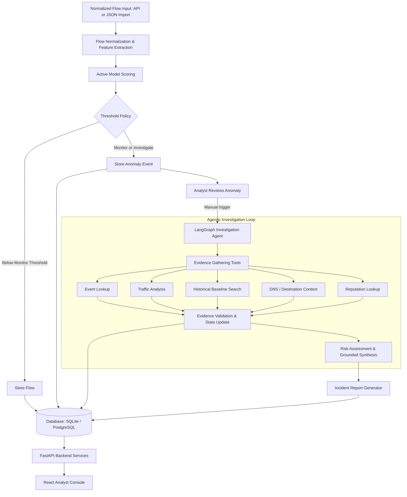
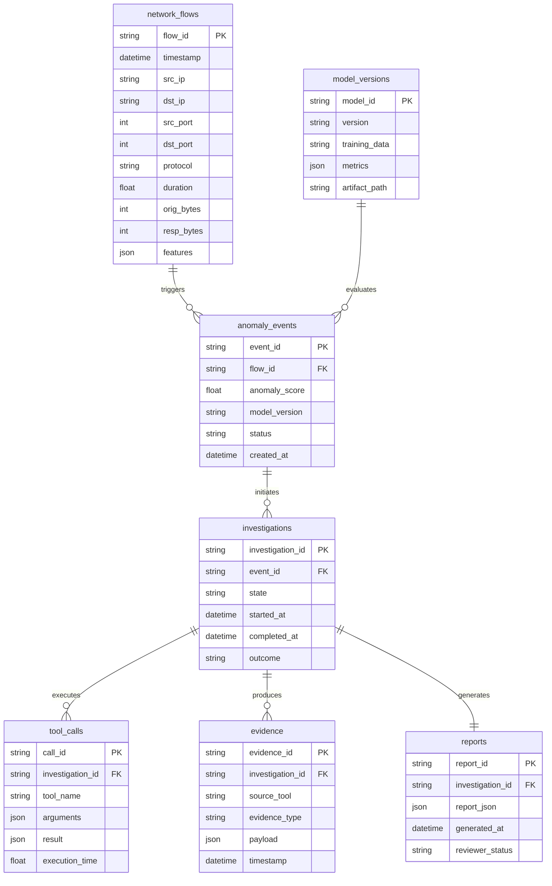

# NetSentry AI

> **Intelligent Network Anomaly Detection and Evidence-Grounded Agentic Investigation System**

[](https://www.python.org/)
[](https://fastapi.tiangolo.com/)
[](https://langchain-ai.github.io/langgraph/)
[](https://react.dev/)
[](https://scikit-learn.org/)
[](https://www.docker.com/)
[](LICENSE)

---

## Executive Summary

**NetSentry AI** is an intelligent network anomaly detection and evidence-grounded investigation system. The backend accepts normalized flow records through its API, extracts features, scores them with the active detector, and creates anomaly events according to configured thresholds. An analyst can then start an **evidence-driven agentic investigation** from the console. The current application does not capture traffic from a network interface or parse PCAP files.

### Core Philosophy: Separation of Responsibilities

Traditional security tools often suffer from alert fatigue without clear context, while naive LLM implementations hallucinate non-existent threats. NetSentry AI solves this with strict separation of concerns:

- **ML Layer (Detection)**: The active detector reports its model name, version, and feature contract through `/model/info`. The repository includes an Isolation Forest artifact and a deterministic heuristic fallback; the console displays which detector is active.
- **Agentic Investigation Layer**: An analyst-triggered LangGraph workflow queries deterministic tools to inspect stored telemetry and collect evidence. LLM report enhancement is optional. The investigation and report data shown by the console come from the backend.

---

## High-Level System Architecture



### End-to-End Pipeline Overview

1. **Flow Ingestion**: Accepts normalized flow records through `POST /flows/ingest`, `POST /flows/batch`, or the console's JSON/JSONL importer. Network capture and PCAP parsing are not provided by the current application.
2. **Flow Normalization & Feature Extraction**: Converts submitted flow records into the schema and features consumed by the active detector.
3. **Feature Engineering**: Computes per-flow byte and packet rates, totals, and the features in `features/schema.json`. The API currently uses default context values rather than a live rolling aggregator.
4. **Machine Learning Anomaly Detection**: Scores each ingested flow using the active model artifact or the heuristic fallback.
5. **Event Management & Triage**: Applies the configured monitor and investigate thresholds and stores qualifying anomaly events. An investigation is not started automatically.
6. **LangGraph Agentic Investigation**: After an analyst starts it, the workflow queries deterministic tools to collect evidence and evaluate hypotheses.
7. **Hallucination Control & Grounding**: The optional report prompt requires findings to cite tool names and prohibits inventing indicators. Basic metrics and risk scores remain deterministic.
8. **Incident Reporting & Visualization**: The backend generates structured reports and the React console presents flow records, anomaly events, investigations, evidence, and analyst review actions.

---

## Repository Structure

```text
NetSentry AI/
├── capture/                  # Flow normalization and JSONL source helpers
│   ├── normalizer.py         # Schema normalization for flow records
│   └── jsonl_source.py       # JSONL flow source
├── features/                 # Feature extraction & processing
│   ├── flow_features.py      # Flow-level feature extractors
│   └── schema.json           # Frozen detector feature contract
├── ml/                       # Machine learning anomaly detection
│   ├── predict.py            # Scoring & inference pipeline
│   ├── real.py               # Scikit-learn artifact adapter
│   ├── stub.py               # Heuristic fallback detector
│   └── netsentry_ml_outputs/ # Trained model artifact and validation outputs
├── events/                   # Event lifecycle management
│   ├── event_manager.py      # Triage, deduplication, queue management
│   └── threshold.py          # Dynamic & static score threshold policies
├── agent/                    # Agentic AI investigation framework
│   ├── graph.py              # LangGraph state machine definition
│   ├── state.py              # InvestigationState schema
│   ├── prompts.py            # Evidence-grounded system prompts
│   └── tools/                # Deterministic investigation tools
│       └── deterministic.py  # Flow, history, destination, DNS, and reputation tools
├── api/                      # Backend REST API
│   ├── main.py               # FastAPI application entrypoint
│   └── schemas.py            # API request and response schemas
├── database/                 # Persistence layer
│   ├── models.py             # SQLAlchemy ORM schemas
│   └── repository.py         # Database CRUD operations
├── dashboard/                # Legacy Streamlit interface
│   └── app.py
├── frontend/                 # React analyst console
│   ├── src/App.tsx           # Navigation, API-backed pages, and flow import
│   ├── src/Overview.tsx      # Flow and anomaly overview
│   ├── src/CaseView.tsx      # Investigation evidence and report view
│   ├── src/TrafficAnalytics.tsx
│   └── src/api.ts            # FastAPI client
├── reports/                  # Automated reporting engine
│   └── generator.py          # Structured JSON report builder
├── tests/                    # Unit and integration tests
├── configs/                  # YAML / JSON system configurations
├── docker/                   # Dockerfiles and docker-compose configurations
├── requirements.txt          # Python dependencies
└── README.md                 # Project documentation
```

---

## Tech Stack & Key Technologies

| Layer | Current Implementation | Notes |
| :--- | :--- | :--- |
| **Language** | Python 3.10+ | Backend |
| **Traffic Telemetry** | Normalized flow records through the API or JSON/JSONL importer | Network capture and PCAP parsing are not included |
| **ML Engine** | Scikit-learn Isolation Forest artifact or heuristic fallback | Active detector is reported by `/model/info` |
| **Agent Orchestration** | LangGraph workflow with deterministic tools | Investigation is analyst-triggered |
| **LLM Provider** | Optional Gemini report synthesis | Backend setting; investigations work without it |
| **Backend API** | FastAPI + Uvicorn | API documentation at `/docs` |
| **Database** | SQLAlchemy persistence | Database URL is configured on the backend |
| **Dashboard** | React, Vite, TypeScript | Legacy Streamlit interface remains in `dashboard/` |
| **Packaging** | Docker Compose configuration is provided | Local Python and npm development are also supported |

### React Console Data and Actions

The React console does not contain a demo data mode. It displays data returned by the FastAPI backend, and its actions use the corresponding API endpoints.

| Console page | What it presents | Backend contract |
| :--- | :--- | :--- |
| Overview | Counts and activity derived from loaded flows, anomalies, and investigations | `GET /flows`, `GET /anomalies`, `GET /investigations`, `GET /model/info`, `GET /health` |
| Flow Records | Search, inspect, and export ingested records and anomaly scores | `GET /flows`, `GET /flows/{flow_id}` |
| Import Flows | Submit normalized records for scoring and storage | `POST /flows/batch` |
| Traffic Analytics | Protocol, destination-port, and source-host breakdowns computed from loaded records | `GET /flows`, `GET /anomalies` |
| Anomalies | Filter events, inspect related flows, change status, and start an investigation | `GET /anomalies`, `GET /flows/{flow_id}`, `PATCH /anomalies/{event_id}`, `POST /investigations/{event_id}` |
| Investigations | Read case state and collected evidence | `GET /investigations`, `GET /investigations/{id}/evidence` |
| Reports | List investigation cases, read generated reports, and submit analyst review | `GET /investigations`, `GET /reports/{id}`, `POST /reports/{id}/review` |
| Model and API Health | Display the active detector, feature order, thresholds, and service status | `GET /model/info`, `GET /health` |
| Settings | Toggle the console's 15-second refresh interval | Browser state only |
| Privacy Policy | Describe the self-hosted console's API and telemetry handling | Static console content |

The console loads up to 500 flows, anomalies, and investigations per feed. Its counts and analytics describe that loaded window, not the entire database. The time-range control filters loaded records locally; the backend does not currently expose historical pagination through this console. Flow import supports `.json`, `.jsonl`, and `.ndjson` files, up to 10 MB and 500 flow records per import.

---

## Machine Learning & Telemetry Specifications

### Example Normalized Flow Record

```json
{
  "timestamp": "2026-09-16T13:42:21Z",
  "src_ip": "192.168.1.10",
  "dst_ip": "10.0.0.25",
  "src_port": 51432,
  "dst_port": 443,
  "protocol": "TCP",
  "duration": 2.31,
  "orig_bytes": 12421,
  "resp_bytes": 85921,
  "orig_pkts": 32,
  "resp_pkts": 91
}
```

### Flow-Level & Behavioral Features

- **Flow Metrics**: Duration, `orig_bytes`, `resp_bytes`, `total_bytes`, `orig_pkts`, and `resp_pkts`.
- **Rates**: Bytes per second and packets per second derived from each flow's duration.
- **Model Feature Contract**: Destination port, TCP indicator, `unique_dst_ports_5min`, and `failed_conn_ratio_5min`. Current API ingestion uses the feature extractor's default context for the last two values; it does not maintain a live rolling traffic aggregator.

### Model and Dataset Notes

The repository includes an Isolation Forest artifact and validation output for CIC-IDS2017. The model artifact reports its version and expected feature order through `/model/info`. Set `MODEL_PATH` to `ml/netsentry_ml_outputs/isolation_forest_v1.joblib` to select this artifact; otherwise the backend uses the configured default path and falls back to the heuristic detector if no artifact is found. The repository does not currently ingest PCAP files or provide a PCAP replay pipeline.

---

## Agentic AI Investigation Workflow (LangGraph)

The current default thresholds are `monitor_at: 0.60` and `investigate_at: 0.85`, configured in `configs/threshold.yaml`. Scores below the monitor threshold are stored without an event; scores from the monitor threshold to below the investigate threshold create monitoring events; scores at or above the investigate threshold create open events. An investigation is started only after an analyst triggers it from the console or API.

### Core Investigation State

```python
class InvestigationState(TypedDict):
    event: dict                   # Original anomaly trigger metadata
    evidence: list[dict]          # Collected verifiable telemetry data
    tool_results: list[dict]      # Raw tool outputs with execution timestamps
    findings: list[str]           # Grounded observations derived from evidence
    risk_level: str               # "low" | "medium" | "high" | "critical"
    confidence: float             # Calibrated confidence score (0.0 - 1.0)
    report: dict                  # Final structured report artifact
    investigation_log: list[str]  # Step-by-step reasoning & tool dispatch trace
```

### Approved Investigation Tools

1. **`get_network_event(event_id)`**: Retrieves the normalized flow record and anomaly metadata.
2. **`analyze_connections(source_ip)`**: Summarizes connection volume, destination diversity, and protocol ratios.
3. **`search_historical_traffic(ip, window)`**: Checks past baselines to verify whether the observed behavior is recurring or novel.
4. **`analyze_destination(destination_ip)`**: Gathers destination host telemetry, known services, and inbound traffic.
5. **`lookup_dns(domain)`**: Uses local lab mappings or the system resolver to look up host context. It does not read captured DNS traffic.
6. **`lookup_reputation(indicator)`**: Checks the deterministic reputation table included with the backend. It does not query an external threat-intelligence provider.

### Evidence Grounding & Hallucination Defense

- **Evidence Traceability**: Tool evidence is stored with the investigation and is shown in the console alongside generated report findings.
- **Fact vs. Hypothesis Separation**: Incident reports explicitly demarcate **Observed Facts** (verifiable data) from **Analytical Hypotheses**.
- **Deterministic Risk Scoring**: Risk ratings combine mathematical deviation metrics with agent synthesis, avoiding pure prompt-based guesswork.

---

## Database Schema



---

## Getting Started

### Prerequisites

- **Python**: 3.10 or higher
- **Node.js and npm**: Required to run the React console
- **Docker & Docker Compose** (Optional for containerized run)

### Installation

1. **Clone the repository:**
   ```bash
   git clone https://github.com/pracheersrivastava/NetSentry.git
   cd NetSentry
   ```

2. **Create and activate a virtual environment:**
   ```bash
   # Linux / macOS
   python3 -m venv venv
   source venv/bin/activate

   # Windows (PowerShell)
   python -m venv venv
   .\venv\Scripts\Activate.ps1
   ```

3. **Install dependencies:**
   ```bash
   pip install --upgrade pip
   pip install -r requirements.txt
   ```

4. **Configure environment variables:**
   ```bash
   cp configs/.env.example .env
   # Edit .env with your LLM API keys (e.g., GEMINI_API_KEY) and DB settings
   # LLM_ENABLED=false for offline demo, true for Gemini synthesis
   ```

### 0. Seed disposable development data

The seed script drops and recreates every table in the configured database before inserting three sample flows. Use it only with a disposable development database. Do not run it against data you need to keep.

```bash
python scripts/seed.py
# the resulting event count depends on the active detector and configured thresholds
```

---

## Running the Application

### 1. Import Normalized Flow Records

Start the backend and React console as shown below, then open the **Import Flows** page. Choose a `.json`, `.jsonl`, or `.ndjson` file containing normalized flow records. The JSON file may contain one record or an array; JSONL and NDJSON contain one JSON object per line. Records must include `src_ip`, `dst_ip`, `src_port`, and `dst_port`. Optional fields include `timestamp`, `protocol`, `duration`, `orig_bytes`, `resp_bytes`, `orig_pkts`, and `resp_pkts`.

The importer accepts files up to 10 MB and 500 records and submits them to `POST /flows/batch` for feature extraction, scoring, storage, and event creation. Raw PCAP files and direct network-interface capture are not supported by the current application. Convert packet captures to normalized flow records with an external tool before importing them.

### 2. Launch FastAPI Backend

```bash
uvicorn api.main:app --host 0.0.0.0 --port 8000 --reload
```
Interactive Swagger UI will be available at [http://localhost:8000/docs](http://localhost:8000/docs).

### 3. Launch the React SOC Console

```powershell
cd frontend
npm install
npm run dev
```
Open [http://localhost:5173](http://localhost:5173) to use the React analyst console. Vite proxies its `/api` requests to the local FastAPI backend at port 8000. Start the backend first. The legacy Streamlit dashboard remains available with `streamlit run dashboard/app.py`.

### 4. Running with Docker Compose

```bash
docker compose -f docker/docker-compose.yml up --build
# needs Docker installed; API at http://localhost:8000
# (local dev without Docker: uvicorn api.main:app --port 8000)
```

### 5. Demo script

```bash
python scripts/seed.py
uvicorn api.main:app --port 8000          # terminal 1
cd frontend; npm install; npm run dev     # terminal 2
# browser: http://localhost:5173 -> Anomalies -> select an event -> Investigate event
# investigations are started by an analyst; crossing the threshold does not start one automatically
```

---

## API Reference

| Method | Endpoint | Description |
| :--- | :--- | :--- |
| `GET` | `/health` | Service health status check |
| `POST` | `/flows/ingest` | Score and store one normalized flow |
| `POST` | `/flows/batch` | Score and store a batch of up to 500 normalized flows |
| `GET` | `/flows` | Query normalized network flows |
| `GET` | `/flows/{flow_id}` | Retrieve a flow record |
| `GET` | `/anomalies` | List anomaly events |
| `GET` | `/anomalies/{event_id}` | Retrieve an anomaly event |
| `PATCH` | `/anomalies/{event_id}` | Update analyst triage status |
| `GET` | `/model/info` | Retrieve active detector, feature order, and thresholds |
| `POST` | `/model/predict` | Score a supplied normalized flow without storing it |
| `POST` | `/investigations/{event_id}` | Start or retrieve the event investigation |
| `GET` | `/investigations` | List investigations |
| `GET` | `/investigations/{id}` | Retrieve investigation status |
| `GET` | `/investigations/{id}/evidence` | Fetch evidence collected by investigation tools |
| `GET` | `/reports/{id}` | Retrieve a structured report |
| `POST` | `/reports/{id}/review` | Record analyst review status |

---

## Evaluation & Benchmark Metrics

The following are evaluation criteria, not live console metrics. The model validation outputs in `ml/netsentry_ml_outputs/` contain the recorded model measurements; the console does not invent or display aggregate benchmark performance.

### ML Layer Evaluation
- **Precision, Recall & F1-Score**: Classification metrics for labeled validation data. The current metrics artifact is for CIC-IDS2017.
- **ROC-AUC and False Positive Rate (FPR)**: Recorded in the model validation output at `ml/netsentry_ml_outputs/isolation_forest_v1_metrics.json`.
- **Inference Latency**: A performance measure for future benchmark runs; it is not shown as a live dashboard metric.

### Agent Layer Evaluation
- **Tool Selection Accuracy**: A measure for evaluating whether relevant evidence tools were selected.
- **Investigation Completeness**: A measure for whether corroborating evidence was collected.
- **Evidence Grounding**: Findings should be checked against the stored tool evidence.
- **Investigation Latency**: A performance measure for future benchmark runs; it is not shown as a live dashboard metric.

---

## Roadmap & Milestones

- [x] Architecture design & formal project specification
- [ ] Optional network capture and PCAP parsing integrations
- [x] Normalized flow ingestion and feature extraction
- [x] Isolation Forest baseline artifact and validation output
- [x] Anomaly event manager with configurable thresholding
- [x] LangGraph state machine and deterministic investigation tools
- [x] Evidence-grounded report generator
- [x] FastAPI backend services and SQLAlchemy persistence
- [x] React SOC analyst console
- [ ] Automated end-to-end benchmark suite

---

## Security, Safety, and Ethical Scope

> **Important**: NetSentry AI is designed strictly for **authorized defensive monitoring and educational/research purposes**.
>
> - **Flow Input**: Accepts normalized flow records through the API or JSON/JSONL console importer. Live interface capture and PCAP parsing are not implemented.
> - **No Offensive Capabilities**: Out of scope: offensive operations, exploitation, credential harvesting, or intrusive packet manipulation.
> - **Data Privacy**: The flow schema contains connection metadata and traffic-volume fields, not raw application payloads. Optional LLM report synthesis may send investigation data to the configured provider.

NetSentry is self-hosted software, not a hosted service with customer accounts. The console includes a Privacy Policy page describing its current behavior; terms for a particular deployment should be supplied by its operator where applicable.

---

## License

This project is licensed under the [MIT License](LICENSE).
